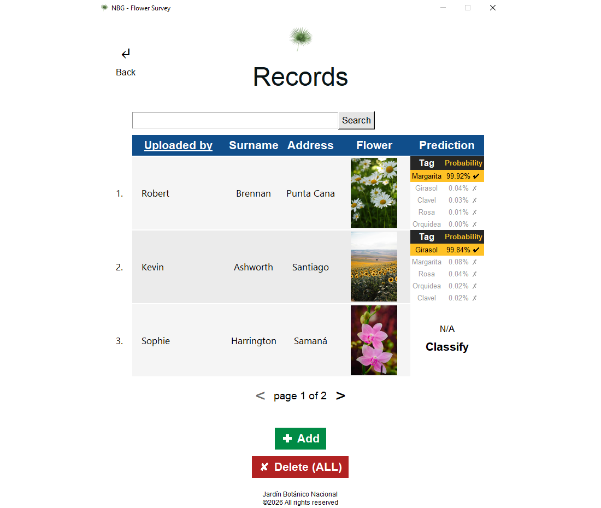
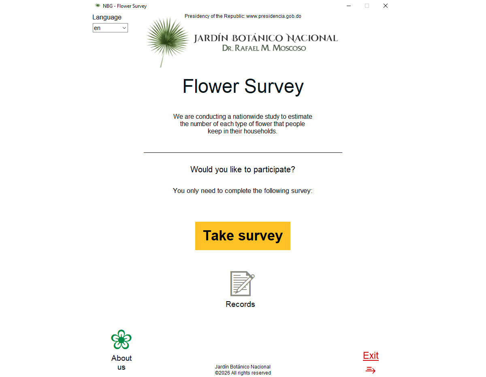
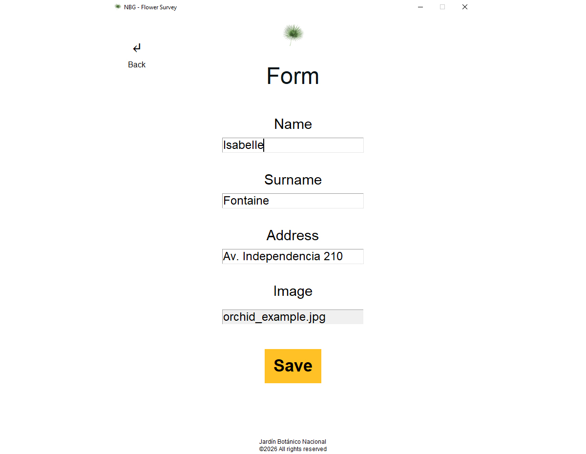
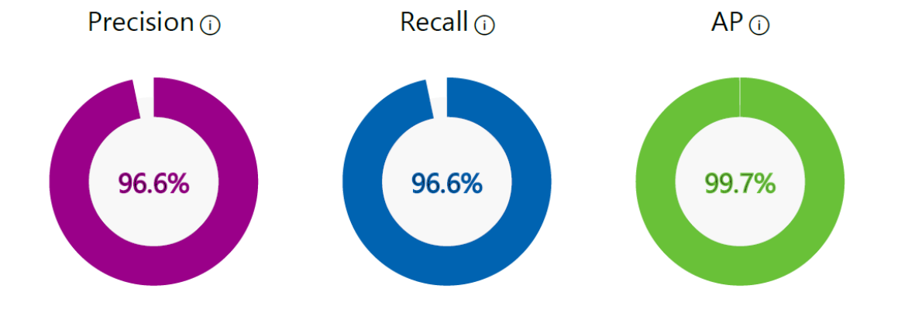
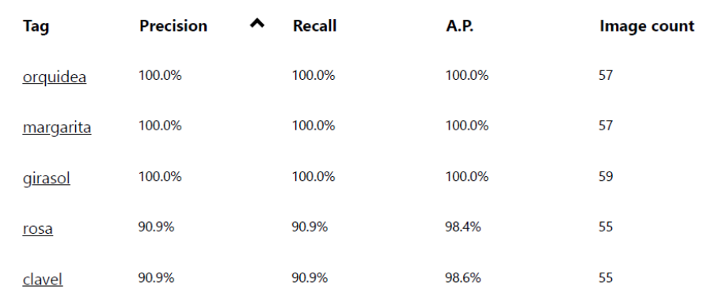
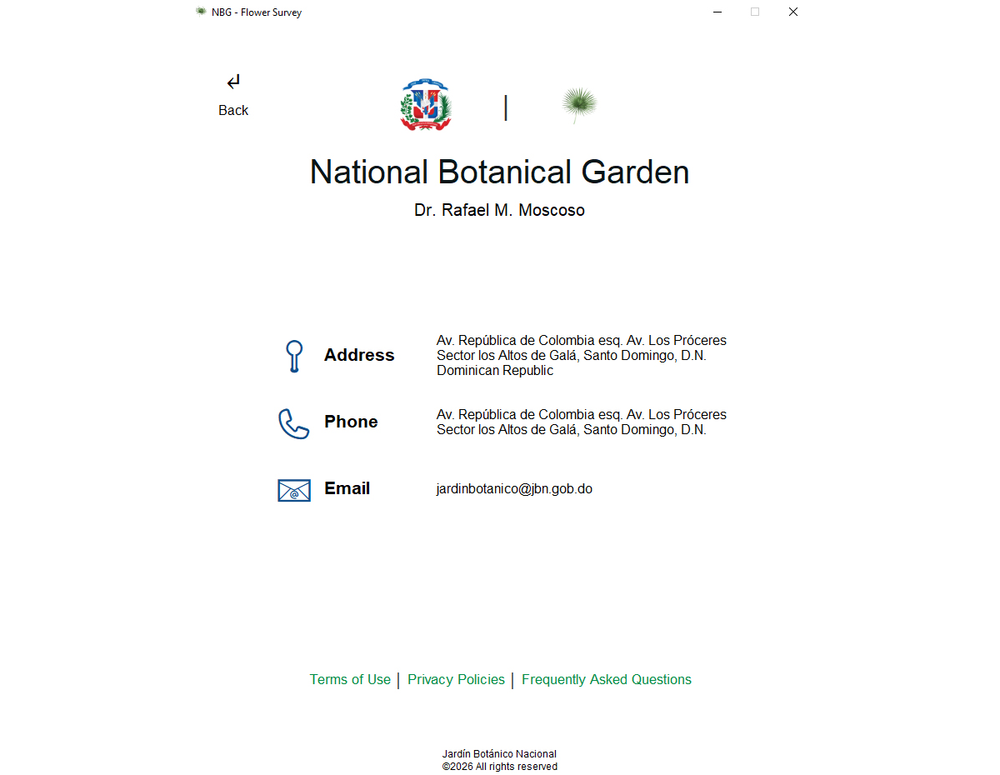

# BotanicalClassifier

Desktop application that classifies five flower types using an Azure Custom Vision model: **roses**, **orchids**, **daisies**, **carnations**, and **sunflowers**. The app provides a Tkinter GUI to collect survey responses, store images locally, and request real-time predictions from Azure Custom Vision.



---

## Table of Contents

- [Motivation](#motivation)
- [Solution](#solution)
- [Features](#features)
- [Architecture](#architecture)
- [Installation](#installation)
  - [Requirements](#requirements)
  - [Install Dependencies](#install-dependencies)
  - [Azure Custom Vision setup](#azure-custom-vision-setup)
  - [`.env` Configuration](#env-configuration)
- [Run Locally](#run-locally)
- [Model Evaluation \& Metrics](#model-evaluation--metrics)
- [Scalability \& Extensibility](#scalability--extensibility)
- [Limitations](#limitations)
- [Attribution \& Credits](#attribution--credits)
- [Contributing](#contributing)
- [License](#license)

---

## Motivation

The Jardín Botánico Nacional is conducting a nationwide research project to estimate how many flowers of each type people keep in their homes. Participants fill a short form and upload a photograph of their plants. All submitted photos are stored locally on the research computer under the naming convention `flower_survey_xx.png`.

The garden needs to assign a flower type to each image automatically. The target classes are roses, orchids, daisies, carnations, and sunflowers. Manual labeling at scale is time-consuming and staff resources are limited, so they require an automated solution to speed up classification and reduce human workload.

---

## Solution

This repository implements a desktop application supporting image ingestion, local storage, a survey GUI, and an integration with Azure Custom Vision to obtain and display model predictions.



---

## Features

- Lightweight desktop GUI for:
  - Filling a short survey (name, surname, address) and attaching a flower image.
  - Saving images and structured records locally for research and audit.
  - Sending images to Azure Custom Vision and displaying sorted predictions by confidence.
  - Browsing and searching stored survey records with a paginated view and manual classification trigger.
- **Local-first design**: images and JSON records are stored locally.
- **Internationalization (i18n)**: English and Spanish language support.



---

## Architecture

The project follows a layered design that separates presentation, business logic, data models, and shared utilities.

### High-level Structure <!-- omit in toc -->

```plain
BotanicalClassifier/
├── dataset/
├── src/
│   ├── common/    # Shared utilities and configuration
│   ├── gui/       # Tkinter UI components
│   ├── models/    # Data models
│   ├── resources/ # Static assets and content
│   ├── services/  # Business logic layer
│   └── app.py     # Application entry point
└── README.md
```

---

### Dataset Organization <!-- omit in toc -->

Training images are organized by class:

```md
dataset/
├── carnations/
├── daisies/
├── orchids/
├── roses/
└── sunflowers/
```

All images follow the `flower_survey_xx.png` convention.

---

## Installation

### Requirements

- [Python](https://www.python.org/downloads/) >= 3.13.9
- [Azure Custom Vision](https://www.customvision.ai/) subscription

---

### Install Dependencies

Install [uv](https://docs.astral.sh/uv/getting-started/installation/):

```bash
# Windows
powershell -ExecutionPolicy ByPass -c "irm https://astral.sh/uv/install.ps1 | iex"

# macOS / Linux
curl -LsSf https://astral.sh/uv/install.sh | sh
```

Then install dependencies from the **repo root**:

```bash
uv sync
```

> **VS Code:** open the Command Palette (`Ctrl+Shift+P`), run **Python: Select Interpreter**, and choose the `.venv` inside `./`. Reload your terminal afterwards.

---

### Azure Custom Vision setup

#### Step 1. Create a Custom Vision project

1. Sign in at [customvision.ai](https://www.customvision.ai).
2. Click **New Project** and configure it:
   - Name: `botanical-classifier`
   - Project Type: **Classification**
   - Classification Type: **Multi-class**
   - Domain: select the one most appropriate for flower images.
   - Resource: create or select an existing one.

#### Step 2. Train the model

1. For each class (roses, orchids, daisies, carnations, sunflowers), upload representative images from the `dataset/` folders to their corresponding tags.
2. Remove duplicates, low-quality, or incorrectly tagged images.
3. Click **Train** > **Quick Training**.
4. Publish the iteration with a descriptive name.

#### Step 3. Get Credentials

- Copy `Prediction Key` and `Endpoint URL` from **Settings**.
- Copy `Project ID` from the **Azure Portal**.
- Note the `Published Name` from your published iteration.

---

### `.env` Configuration

Create a `.env` file at `src/common/.env` and fill in the required values:

```env
CUSTOM_VISION_KEY=
CUSTOM_VISION_ENDPOINT=
CUSTOM_VISION_PROJECT_ID=
CUSTOM_VISION_PUBLISHED_NAME=
```

---

## Run Locally

From the **repo root**:

```bash
uv run src/app.py
```

---

## Model Evaluation & Metrics

| View                  | Image                                                          |
| --------------------- | -------------------------------------------------------------- |
| Overall performance   |            |
| Per-class performance |  |

---

## Scalability & Extensibility

| Extension point      | Detail                                                                                                                        |
| -------------------- | ----------------------------------------------------------------------------------------------------------------------------- |
| **Additional pages** | New page classes in `gui/pages/` integrate with minimal changes to navigation.                                                |
| **More languages**   | Adding a new `xx.json` catalog to `resources/i18n/` requires only a small enum update.                                        |
| **Themes**           | Centralized styles in `gui/styles/` enable dark/light mode support without large code changes.                                |
| **New flower types** | New tags in the Custom Vision model are picked up automatically; the UI adapts without code changes.                          |
| **Larger datasets**  | As dataset size grows or a different model is adopted, the prediction API remains compatible.                                 |
| **Cloud storage**    | `records_service.py` and `paths.py` encapsulate all storage logic, making migration to cloud-based solutions straightforward. |

---

## Limitations

- Single-user desktop design, not intended for concurrent multi-user use.
- Local storage grows unbounded with survey submissions.
- Requires network connectivity and an active Azure Custom Vision subscription.
- Free-tier or constrained subscription limits may restrict monthly prediction volume.
- Classification accuracy degrades with poor image resolution, blur, or non-standard formats.

---

## Attribution & Credits

### Visual Design & Content <!-- omit in toc -->

The application's visual identity and informational content are inspired by and adapted from the **Jardín Botánico Nacional** (National Botanical Garden of the Dominican Republic):

- **UI design**: Layout and color scheme inspired by [jbn.gob.do](https://www.jbn.gob.do/).
- **Branding assets**: Logo, banner images, and iconography sourced from the official website.
- **About content**: Terms, policies, and informational sections translated and adapted from official documentation.



This is an educational project demonstrating Azure Custom Vision integration. All JBN content is used respectfully for demonstration purposes only.

### Dataset <!-- omit in toc -->

- **Image source**: [Pexels](https://www.pexels.com/)
- **Curation**: Abel Eduardo Martínez Robles - [abelrobles0409@gmail.com](mailto:abelrobles0409@gmail.com)

### Technology <!-- omit in toc -->

- **Prediction service**: Azure Custom Vision
- **Application development**: Roniel Antonio Sabala Germán - [ronielsabala@gmail.com](mailto:ronielsabala@gmail.com)

---

## Contributing

Contributions are welcome. Suggested workflow:

1. Fork the repository.
2. Create a feature branch: `feat/my-change`.
3. Make your changes following the existing code style.
4. Include appropriate documentation or tests.
5. Commit, push, and open a pull request describing the change and the reason for it.

---

## License

This project is available under the **MIT License**.
